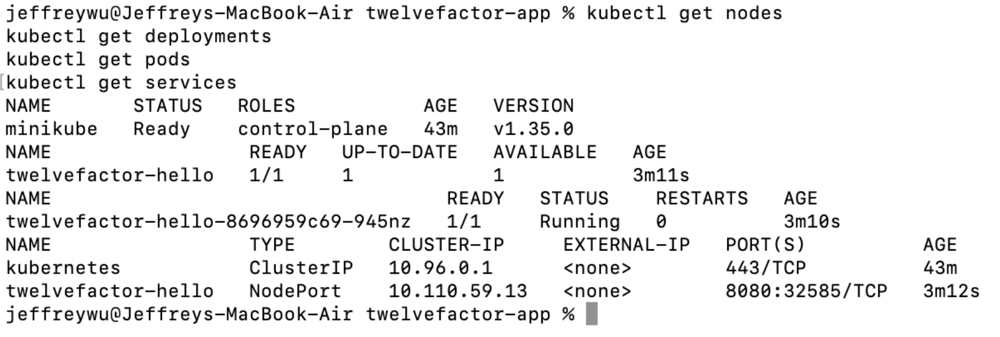

Unit 5 Formative Discussion: Kubernetes Cluster Deployment

Deploy a 12-Factor App using Docker and manage it through Kubernetes. Set up a local Kubernetes cluster using Minikube and deploy a containerised application following the 12-Factor methodology.

Deliverable: Post A step-by-step guide (500 words) explaining how you deployed the 12-Factor app on Kubernetes.

_______________________________
My post:

Deployment of a 12-Factor Node.js Application Using Docker and Kubernetes (Minikube)

This guide describes the deployment of a 12-Factor Node.js application using Docker and Kubernetes via Minikube on macOS (Apple Silicon). The 12-Factor methodology defines best practices for cloud-native applications, emphasising externalised configuration, stateless processes and logging to standard output (Wiggins, 2023).

Step 1: Initialising the Local Kubernetes Cluster

A local Kubernetes cluster was started using Minikube with the Docker driver:

minikube start --driver=docker
Minikube provisions a single-node cluster suitable for development and testing (Minikube, 2024). Cluster status was verified using:

kubectl get nodes
The node reported a “Ready” status, confirming the control plane was operational (Kubernetes, 2024a).

Step 2: Developing the 12-Factor Node.js Application

A minimal Express-based Node.js application was created. It adhered to 12-Factor principles by:

Reading configuration from environment variables (process.env.MESSAGE, process.env.PORT)
Logging requests to standard output
Avoiding persistent local storage
The methodology requires configuration to be externalised via environment variables to ensure portability across environments (Wiggins, 2023).

Step 3: Containerisation Using Docker

A Dockerfile was created using node:20-alpine as a lightweight base image. Dependencies were installed via npm install, and port 8080 was exposed. The image was built locally:

docker build -t twelvefactor-hello:1.0 .
Containerisation encapsulates runtime dependencies, ensuring environmental consistency (Pahl, 2024). The image was loaded into Minikube:

minikube image load twelvefactor-hello:1.0 
Step 4: Kubernetes Deployment

Kubernetes manifests defined a Deployment and NodePort Service. The Deployment specified one replica, IfNotPresent image policy, and environment variables. Resources were applied using:

kubectl apply -f k8s/
Verification was performed using:

kubectl get pods
kubectl get services

Figure 1: Kubernetes node, deployment, pod and service status confirming successful orchestration.

As shown in Figure 1, the Minikube node reported a Ready state, while the twelvefactor-hello pod reached a Running (1/1) status, confirming successful orchestration.

Step 5: Verification of 12-Factor Compliance

The application was accessed via:

minikube service twelvefactor-hello
The HTTP response confirmed successful service exposure.

To demonstrate configuration externalisation, the MESSAGE variable was updated without rebuilding the image:

kubectl set env deployment/twelvefactor-hello MESSAGE="Updated message"

kubectl rollout restart deployment/twelvefactor-hello

Figure 2: Updating environment variables dynamically without rebuilding the container image.

As illustrated in Figure 2, the deployment was updated dynamically without rebuilding the container image, reflecting separation of configuration from code (Wiggins, 2023).

Application logs were retrieved via:

kubectl logs -l app=twelvefactor-hello

Figure 3: Application logs streamed from the running Kubernetes pod.

As demonstrated in Figure 3, runtime logs were streamed from the container to standard output, which Kubernetes aggregates centrally (Kubernetes, 2024b).

Finally, horizontal scalability was demonstrated:

kubectl scale deployment/twelvefactor-hello --replicas=3

Figure 4: Multiple pod replicas created following horizontal scaling.
As shown in Figure 4, Kubernetes instantiated multiple replicas, confirming the stateless process model and horizontal scalability.

Conclusion

The deployment successfully demonstrated containerisation, orchestration, configuration management, log aggregation, and horizontal scalability in alignment with 12-Factor principles. The integration of Docker and Kubernetes via Minikube provides a reproducible, cloud-native deployment workflow suitable for modern DevOps and cloud engineering environments.

References

Kubernetes (2024a) Nodes. Available at: https://kubernetes.io/docs/concepts/architecture/nodes/ (Accessed: 14 February 2026).

Kubernetes (2024b) Logging Architecture. Available at: https://kubernetes.io/docs/concepts/cluster-administration/logging/ (Accessed: 14 February 2026).

Minikube (2024) Start a Cluster. Available at: https://minikube.sigs.k8s.io/docs/start/ (Accessed: 15 February 2026).

Pahl, C. (2024) ‘Containerisation and Cloud-Native Systems’, IEEE Cloud Computing, 11(2), pp. 45–53.

Wiggins, A. (2023) The Twelve-Factor App. Available at: https://12factor.net/ (Accessed: 15 February 2026).
